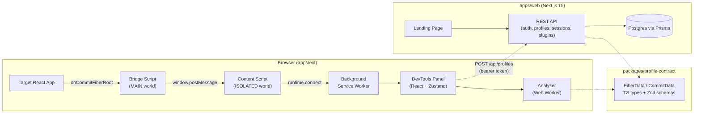

# React Perf Profiler

> Stop guessing. Start profiling.

**React Perf Profiler** is an open-source Chrome DevTools extension for profiling React component performance. It detects wasted renders, scores memoization effectiveness, attributes render causes, and tells you exactly what to fix — without leaving DevTools.

This repository is a Turborepo monorepo containing the browser extension, a Next.js marketing/API app, and shared packages.

## What's inside?

### Apps

- **[`apps/ext`](apps/ext/README.md)** — the WXT-based Manifest V3 browser extension (Chrome + Firefox). This is the core product: a React 19 + shadcn/ui DevTools panel that hooks `__REACT_DEVTOOLS_GLOBAL_HOOK__.onCommitFiberRoot`, performs delta-diffing of Fiber commits, attributes render causes, and analyzes profiles in a Web Worker.
- **[`apps/web`](apps/web)** — a Next.js 15 app serving as the public marketing site (`reactperfprofiler.com`) and a REST API for first-party cloud sync (auth, profiles, sessions, plugins).

### Packages

- **[`packages/profile-contract`](packages/profile-contract/README.md)** — the single source of truth for the profile data contract (`FiberData`, `CommitData`, `AnalysisResult`) shared between the extension and the web API, with both TypeScript types and Zod runtime schemas.
- **[`packages/eslint-config`](packages/eslint-config)** — shared ESLint flat configs (`base`, `next-js`, `react-internal`).
- **[`packages/typescript-config`](packages/typescript-config)** — shared `tsconfig.json` presets (`base`, `react-library`, `nextjs`).

### Extension sub-packages (`apps/ext/packages/*`)

- `@react-perf-profiler/analyzer` — framework-agnostic profile analysis (wasted renders, memoization, performance scoring, anomaly detection).
- `@react-perf-profiler/cli` — `rpp` CLI for headless performance budgets in CI.
- `@react-perf-profiler/vscode-extension` — VS Code extension that surfaces profiler diagnostics inline.
- `@react-perf-profiler/test-plugin` — Vitest integration for asserting render behavior in tests.

## Quick start

### Prerequisites

- [Node.js](https://nodejs.org/) 18+
- [bun](https://bun.sh/) 1.3+

### Install dependencies

```bash
git clone https://github.com/rejisterjack/react-perf-profiler.git
cd react-perf-profiler
bun install
```

### Build everything

```bash
bun run build          # turbo run build (all apps + packages)
bun run check-types    # turbo run check-types
bun run lint           # turbo run lint
```

### Run the extension only

If you only want to develop the extension (and skip the web app's env requirements):

```bash
cd apps/ext
bun install
bun run dev            # WXT dev server with HMR
```

Then load it into Chrome: `chrome://extensions` → enable **Developer mode** → **Load unpacked** → select `apps/ext/.output/chrome-mv3/`. See [`apps/ext/README.md`](apps/ext/README.md) for full instructions.

### Run the web app

The web app requires a Postgres database and a few environment variables. Copy [`apps/web/.env.example`](apps/web/.env.example) to `apps/web/.env` and fill it in, then:

```bash
cd apps/web
bun run db:push        # apply schema to your database
bun run dev            # http://localhost:7394
```

## Architecture



The bridge hooks into `__REACT_DEVTOOLS_GLOBAL_HOOK__.onCommitFiberRoot` to intercept React Fiber commits, then forwards them through a rate-limited 4-stage pipeline (MAIN → ISOLATED → Service Worker → Panel) to the DevTools panel, where the analyzer Web Worker scores them.

> **Note:** The bridge relies on React's DevTools global hook, which is only present in **development** builds of React. Production (`NODE_ENV=production`) React builds do not expose this hook and cannot be profiled by this extension. This is a documented limitation shared with React DevTools itself.

## Tech stack

- **Monorepo:** Turborepo + bun workspaces
- **Extension:** [WXT](https://wxt.dev/), React 19, shadcn/ui (Nova), Tailwind CSS v4, Zustand + Reselect, D3.js
- **Web:** Next.js 15 (App Router), React 19, Prisma 6, NextAuth v5, Tailwind CSS 3
- **Shared:** TypeScript 5.9, ESLint 9, Prettier 3, Zod 3

## Documentation

- Extension install, usage, architecture: [`apps/ext/README.md`](apps/ext/README.md)
- Contributing guide: [`apps/ext/CONTRIBUTING.md`](apps/ext/CONTRIBUTING.md)
- Security policy & disclosure: [`apps/ext/SECURITY.md`](apps/ext/SECURITY.md)
- Changelog: [`apps/ext/CHANGELOG.md`](apps/ext/CHANGELOG.md)
- Roadmap: [`apps/ext/ROADMAP.md`](apps/ext/ROADMAP.md)
- Profile data contract: [`packages/profile-contract/README.md`](packages/profile-contract/README.md)

## License

[MIT](LICENSE) — open source and free forever.
